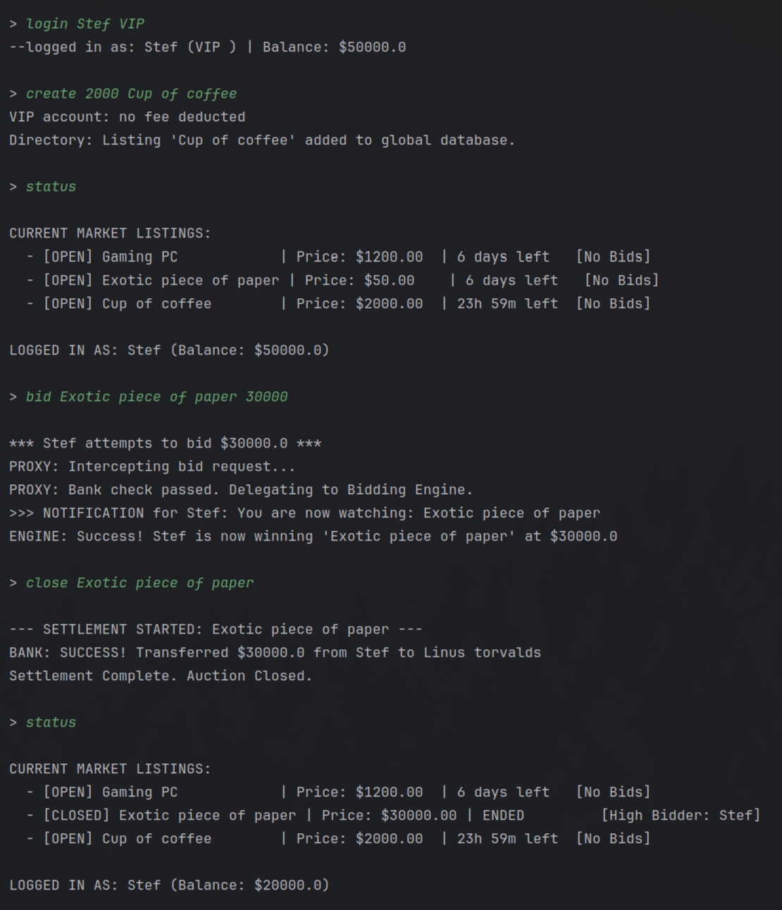

#  A Console-Based Auction House

**Auction house** is a simulation of a real-time marketplace that operates entirely within the command-line interface. It demonstrates how complex software architectures can be managed using industry-standard Design Patterns.

In this simulation, users can:
* **Create Accounts:** Choose between 'Standard' (fee-based) or 'VIP' (fee-exempt) tiers.
* **List Items:** create auction listings with optional parameters like reserve prices and durations.
* **Bid Real-Time:** Place bids on active items. The system validates solvency and enforces auction rules.
* **Close items** Close auctions whenever they want.
* **Experience a Real Economy:** Money is deducted for listing fees and transferred from buyers to sellers upon successful auction closure.

The project is built to showcase the interaction between **Creational** (Factory, Builder), **Structural** (Facade, Proxy), and **Behavioral** (Observer, Command) patterns.

---

### Important Note on Login system
This application is a **architectural demonstration** and does not implement a good or robust login system, just enough to interact with the simulation.

## 1. Creational Patterns (Object Creation)

### A. Factory Method Pattern
* **Location:** `src/patterns/creational/UserFactory.java`
* **Affected Files:** `src/model/User.java`, `src/model/StandardUser.java`, `src/model/VIPUser.java`
* **Job:** Encapsulates the logic of creating different types of users (`Standard` vs `VIP`). Instead of the main program instantiating specific classes and setting manual starting balances, the client simply asks the factory to "create a VIP user," and the factory handles the initialization details and configuration.

### B. Builder Pattern
* **Location:** `src/patterns/creational/StandardListingBuilder.java`
* **Affected Files:** `src/patterns/creational/IListingBuilder.java`, `src/model/AuctionListing.java`
* **Job:** Solves the "Telescoping Constructor" problem for `AuctionListing` objects. An auction listing requires mandatory fields (title, price) but also has many optional parameters (description, reserve price, duration). The Builder allows these complex objects to be constructed step-by-step in a readable, fluent way (e.g., `.setReservePrice(100).build()`).

---

## 2. Structural Patterns (System Composition)

### A. Facade Pattern
* **Location:** `src/patterns/structural/AuctionSystemFacade.java`
* **Affected Files:** `src/services/BankService.java`, `src/services/AuctionDirectory.java`, `Main.java`
* **Job:** Acts as a simplified "control panel" or entry point for the entire application. It hides the complexity of the underlying subsystems (Bank, Directory, User Creation, Proxy) from the `Main` class. The client interacts with simple methods like `facade.placeBid()` without needing to understand how the subsystems are wired together.

### B. Proxy Pattern
* **Location:** `src/patterns/structural/SecurityBiddingProxy.java`
* **Affected Files:** `src/services/IBiddingService.java`, `src/services/BiddingEngine.java`, `src/services/BankService.java`
* **Job:** Controls access to the critical `BiddingEngine`. The Proxy acts as a "security guard" that intercepts bid requests. It collaborates with the `BankService` to ensure the user has sufficient solvency *before* allowing the request to reach the real engine. This strictly separates validation logic from business logic.

---

## 3. Behavioral Patterns (Object Communication)

### A. Observer Pattern
* **Location:** `src/model/AuctionListing.java` (Subject)
* **Affected Files:** `src/patterns/behavioral/Observer.java` (Interface), `src/model/User.java` (Concrete Observer)
* **Job:** Establish a subscription mechanism for real-time updates. When an `AuctionListing` receives a new high bid, it automatically iterates through its list of registered `User`s (Observers) and calls their `update()` method. This ensures users are immediately notified when they are outbid or when a reserve price is met without needing to poll the system.

### B. Command Pattern
* **Location:** `src/patterns/behavioral/command/` (Folder)
* **Affected Files:** `CommandFactory.java`, `BidCommand.java`, `LoginCommand.java`, `Command.java`
* **Job:** Encapsulates user requests as standalone objects. This decouples the user interface (text input) from the logic that executes the action. It allows the application to parse dynamic text inputs (like "bid Gaming PC 500") and map them to specific execution logic without populating the `Main` class with complex `if/else` statements.